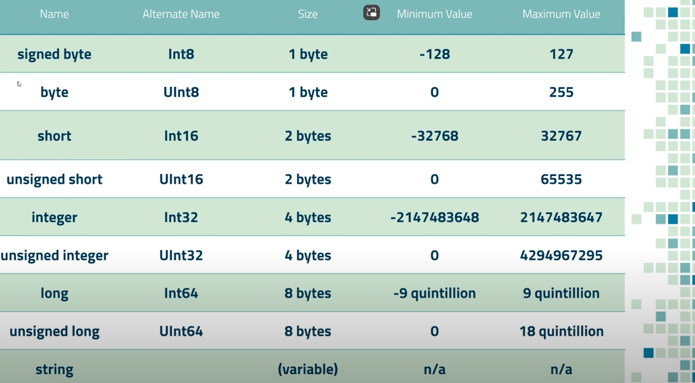
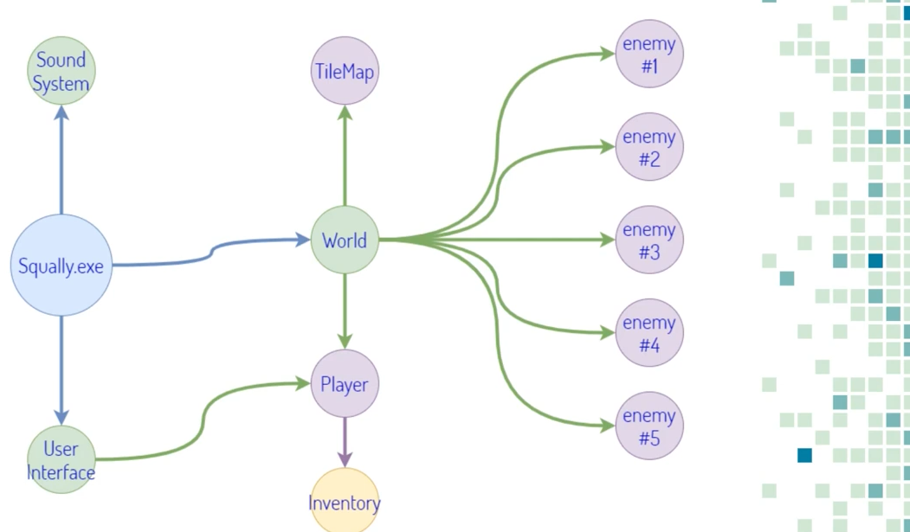

Base counting -> calculator programming
Decimal 15
Binary 1111 -> 8,4,2,1 -> 0011 = 3, 0111 = 7, etc.
Hexa 15 = letter F,
1,2,3,4,5,6,7,8,9,A,B,C,D,E,F,10,11
dus 16 = 10, 17 =11, 18=12, etc 26=1A -> gelukkig rekenmachine om om te rekenen

Byte sizes

Cheat engine find gold and edit it. but because in ram it changes everytime (random allocated memory). we can relocate this thanks to pointers

They are unidirectional so you can not find them from enemy but start from world
dll are also static

Finished
Squally
