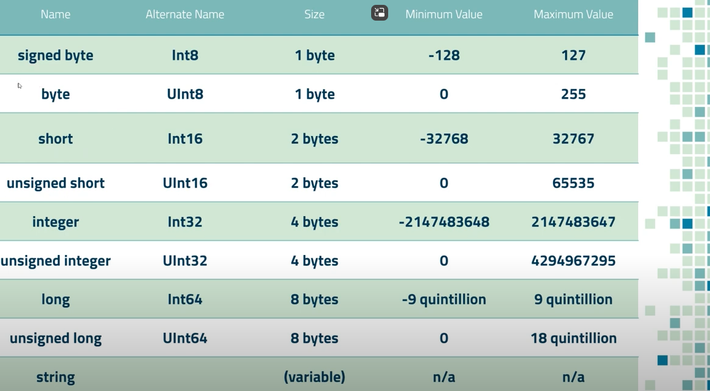
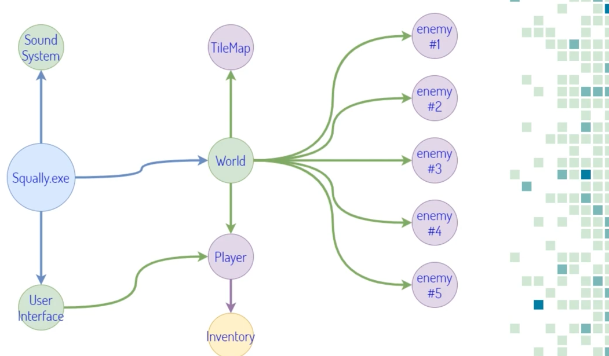

Learning curve game hacking

Games TODO

Assault Cube -> CSGO -> COD4 -> Sauerbraten x64 -> Whatever You Want

1 week​
Learn the absolute basics of using Cheat Engine​
2 – 3 weeks​
Learn enough CE to use all it’s features, how to find pointers etc…​
2 months​
Learn C++/C# well enough to make a hello world and know the absolute basics of coding​
3 – 6 months​
Experienced enough to make very basic trainers in C++/C# based on stuff you find in Cheat Engine​
6 – 12 months​
Experienced enough to make hacks without pasting, basic aimbot & ESP​
1 - 1.5 Years​
Intermediate coding/reversing skills to hack any game you want without anticheat​
1.5 - 2 Years​
Start reversing anticheat​

Base counting -> calculator programming
Decimal 15
Binary 1111 -> 8,4,2,1 -> 0011 = 3, 0111 = 7, etc. 
Hexa 15 = letter F,
1,2,3,4,5,6,7,8,9,A,B,C,D,E,F,10,11
dus 16 = 10, 17 =11, 18=12, etc 26=1A -> gelukkig rekenmachine om om te rekenen

Byte sizes

Cheat engine find gold and edit it. but because in ram it changes everytime (random allocated memory). we can relocate this thanks to pointers

They are unidirectional so you can not find them from enemy but start from world 
dll are also static

